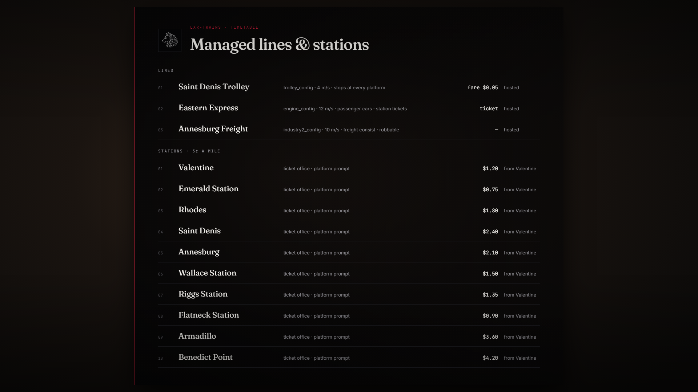

# lxr-trains — Trains & Tramway for LXRCore

Keeps the railroad alive on The Land of Wolves:

* **Ambient rail traffic** — the game's own freight/passenger trains and the
  Saint Denis trolley are requested on every client (`Config.Ambient`). A stock
  RedM server shows them only by luck; here it is a setting.
* **Managed lines** — trains that always exist while players are online. The
  server keeps the timetable, picks a *host* client to spawn each train
  (`_CREATE_MISSION_TRAIN`), records the network id and re-hosts when that
  player leaves. Cruise speed, station stops, whistles, collision avoidance,
  destructibility and blips are per line in `Config.Lines`.
* **Stations & tickets** — a prompt at every station sells tickets (catalog
  item `train_ticket` with `info.from / info.to`), charges through the core
  ledger, refunds unused tickets (`/ticketrefund`), and offers optional fast
  travel with a surcharge. Railroad / marshal / postal jobs ride free.
* **Boarding** — when a managed passenger train waits at a station a *Board*
  prompt appears; the server checks the ticket or fare before the warp.
* **Robbery hooks** — a robbable line that stops outside a station fires
  `lxr:train:halted(lineId, coords)` for heist resources.

## Events (server)

| Event | Args |
|---|---|
| `lxr:train:spawned` | `lineId, netId, hostSource` |
| `lxr:train:removed` | `lineId, reason` |
| `lxr:train:arrived` / `lxr:train:departed` | `lineId, stationIndex` |
| `lxr:train:halted` | `lineId, coords` |
| `lxr:train:ticket` | `source, fromId, toId, price` |
| `lxr:train:boarded` | `source, lineId, ticketInfo` |
| `lxr:train:fastTravel` | `source, fromId, toId, price` |

`GlobalState['lxr-trains']` holds `{ [lineId] = { netId, host, label, blip, fare, stops } }`.

## Security

Only the assigned host may report a train, and only from within
`Config.Security.hostReportRange` of the spawn point; tickets are sold only at
the station the player stands at; boarding consumes a ticket server-side;
every net event is rate limited; every refusal is logged as an exploit attempt
through lxr-core.

## Status

Syntax-checked and cross-checked against the core API. Train natives are from
the RDR3 native database (`_CREATE_MISSION_TRAIN`, `_SET_TRAIN_STOPS_FOR_STATIONS`,
`SET_TRAIN_CRUISE_SPEED`, `IS_TRAIN_WAITING_AT_STATION`, …). **NOT TESTED**
in-game: spawn points in `Config.Lines` are approximate and are snapped to the
nearest track; adjust after the first run.

## Configuration

Everything is in `config.lua`; nothing in `client/` or `server/` needs editing.
Train config names → hashes live in `Config.TrainConfigs`.

© 2026 iBoss21 / LXRCore | lxrcore.com | All Rights Reserved — see LICENSE.
